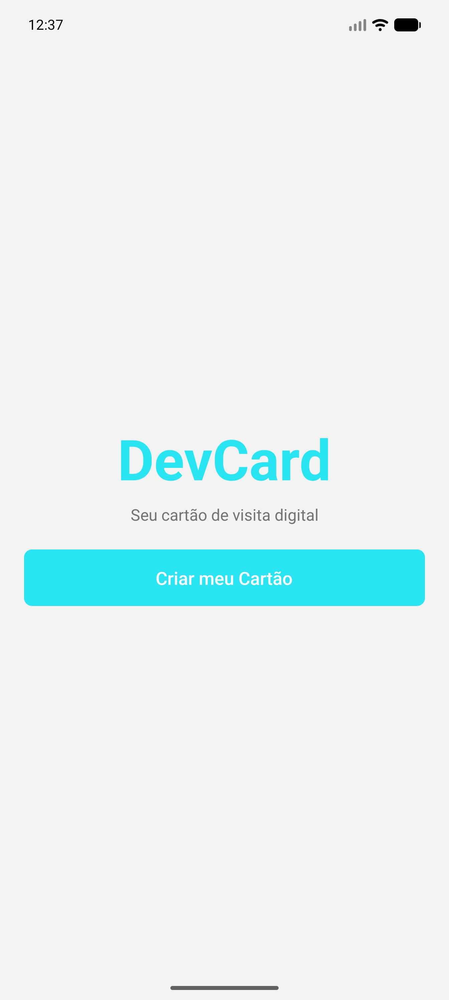
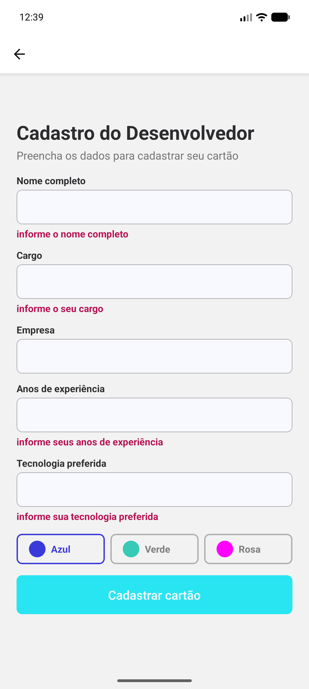
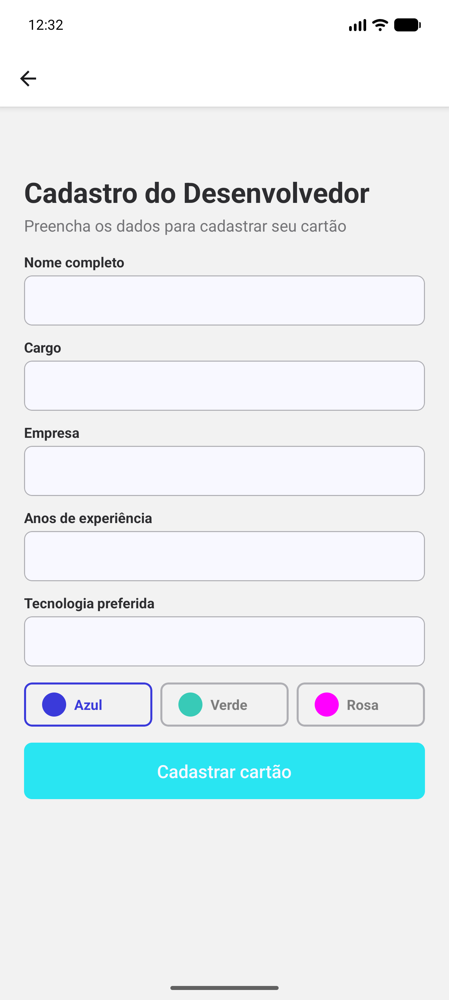
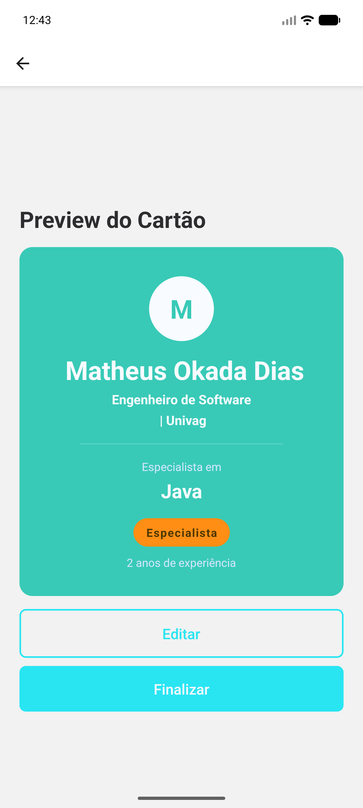
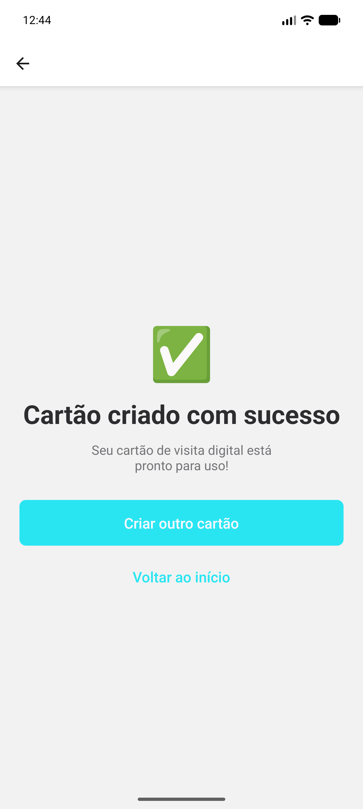

DevCard
O DevCard é um aplicativo móvel desenvolvido como um cartão de visita digital focado em desenvolvedores mobile. O objetivo principal da aplicação é servir como uma apresentação profissional interativa, permitindo que o usuário gere um cartão estilizado com suas principais informações de carreira.

Este projeto foi construído para colocar em prática conceitos fundamentais do desenvolvimento mobile moderno, aplicando o uso prático de TypeScript, estilização de layouts com Flexbox, gerenciamento de estado de variáveis, validação de formulários, lógica condicional e navegação entre telas utilizando o Expo Router.

Funcionalidades Principais
Navegação Estruturada: O aplicativo possui um fluxo de 4 telas interligadas (Boas-vindas, Cadastro, Preview e Sucesso). O roteamento explora diferentes comportamentos de navegação do Expo Router, utilizando os métodos push, back e replace de acordo com a necessidade de cada etapa do usuário.
Formulário com Validação: A tela de cadastro conta com campos para inserção de dados profissionais (Nome, Cargo, Empresa, Anos de experiência e Tecnologia favorita), com regras rígidas de validação e controle de estado individual para garantir a consistência das informações.
Geração de Cartão Dinâmico: Os dados validados são enviados via parâmetros de rota para a tela de Preview, onde um cartão personalizado é renderizado utilizando Flexbox.
Lógica Condicional de Interface: O layout do cartão se adapta às entradas do usuário. A cor de fundo muda conforme a seleção no formulário, e o sistema calcula automaticamente e exibe uma badge de nível de senioridade (Júnior, Pleno ou Sênior) baseada nos anos de experiência informados.

Autor
Matheus Okada Dias

Telas do Aplicativo

Tela de Boas-vindas

A porta de entrada do DevCard, focada em oferecer uma experiência simples e direta ao usuário.

Identidade: Apresenta o logótipo e o nome da aplicação de forma centralizada.
Proposta de Valor: Uma breve descrição que posiciona o app como uma ferramenta para criar cartões de visita digitais para desenvolvedores mobile.
Ação Principal: Botão interativo que encaminha o utilizador para o fluxo de cadastro via expo-router.

Tela de Cadastro (Com Erros de Validação)

Tela de Cadastro
 Nesta tela, o utilizador fornece os dados técnicos e pessoais para a geração do seu cartão digital. O formulário conta com lógica de validação robusta para garantir a integridade dos dados.

Elementos de Entrada:
Campo de texto para Nome Completo
Campo de texto para Cargo
Campo de texto para Empresa
Campo numérico para Anos de Experiência
Campo de texto para Tecnologia Favorita
Seletor de estilo (Control/Botões) para escolha da Cor do cartão.
Destaques Técnicos:

Validação em Tempo Real: O campo "Anos de Experiência" aceita apenas números e valida valores negativos.
Tratamento de Erros: Exibe mensagens específicas por campo e um alerta de "Erro Geral" caso requisitos mínimos não sejam atendidos ao tentar submeter.
Seleção Dinâmica: Botões de cores interativos que permitem personalizar a estética do cartão final.
Acessibilidade e UX: Uso de KeyboardAvoidingView para evitar que o teclado oculte os inputs e ScrollView para garantir usabilidade em dispositivos menores.

Tela de Preview do Cartão

1 - Visualização do cartão: Cartão sendo visuzalidao dinamicamente.
2 - Cartão sendo copiado: Feedback visual mostrando que o cartão foi copiado com sucesso.

Tela de Sucesso

A tela final que confirma a criação do cartão e oferece opções para reiniciar o fluxo ou retornar ao início.

Destaques Técnicos:

Feedback Visual Positivo: Utiliza elementos visuais (emoji/imagem) e mensagens claras para confirmar que a operação foi realizada com êxito.
Gerenciamento de Navegação: Utiliza o router.replace('/') no botão de novo cartão, garantindo que o histórico de navegação anterior seja resetado, impedindo que o usuário volte acidentalmente para os dados do cartão já finalizado.
UX (Experiência do Usuário): Fornece uma saída clara para o fluxo, permitindo que o usuário escolha entre criar um novo perfil ou apenas voltar à tela inicial.

